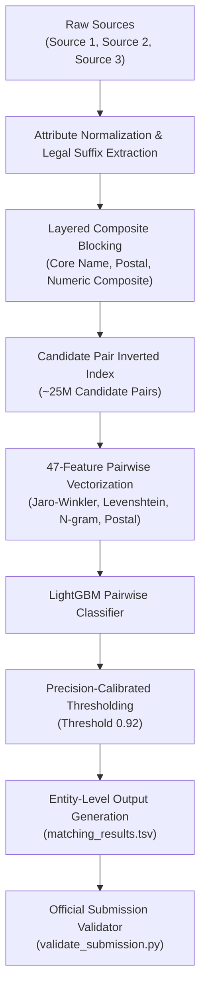

# System Architecture & Flow Diagram

```mermaid
flowchart TD
    A["Raw Sources<br/>(Source 1, Source 2, Source 3)"] --> B["Attribute Normalization & Legal Suffix Extraction"]
    B --> C["Layered Composite Blocking<br/>(Core Name, Postal, Numeric Composite)"]
    C --> D["Candidate Pair Inverted Index<br/>(~25M Candidate Pairs)"]
    D --> E["47-Feature Pairwise Vectorization<br/>(Jaro-Winkler, Levenshtein, N-gram, Postal)"]
    E --> F["LightGBM Pairwise Classifier"]
    F --> G["Precision-Calibrated Thresholding<br/>(Threshold 0.92)"]
    G --> H["Entity-Level Output Generation<br/>(matching_results.tsv)"]
    H --> I["Official Submission Validator<br/>(validate_submission.py)"]
```
